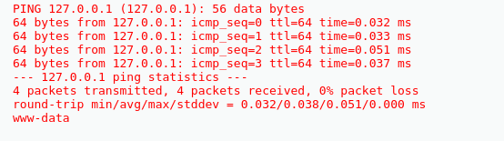
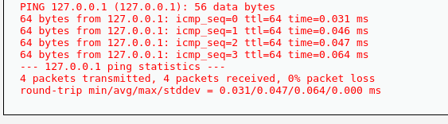
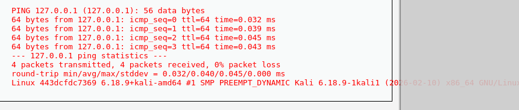

# DVWA Command Injection Exploitation

## Overview
This project demonstrates a command injection vulnerability in DVWA. It shows how attackers can execute system commands through unsanitized input.

## Objective
Exploit command injection vulnerability to execute system commands.

## Tools Used
- Kali Linux
- DVWA
- Web Browser

## Steps
1. Set DVWA security level to LOW
2. Navigated to Command Injection module
3. Injected payload:
```bash
127.0.0.1; whoami
```

## Result
Successfully executed system commands on the server.

## Impact
- Allows remote command execution
- Can expose sensitive system data
- May lead to full system compromise

## Proof of Exploitation

### Whoami Output


### List Files


### System Info

